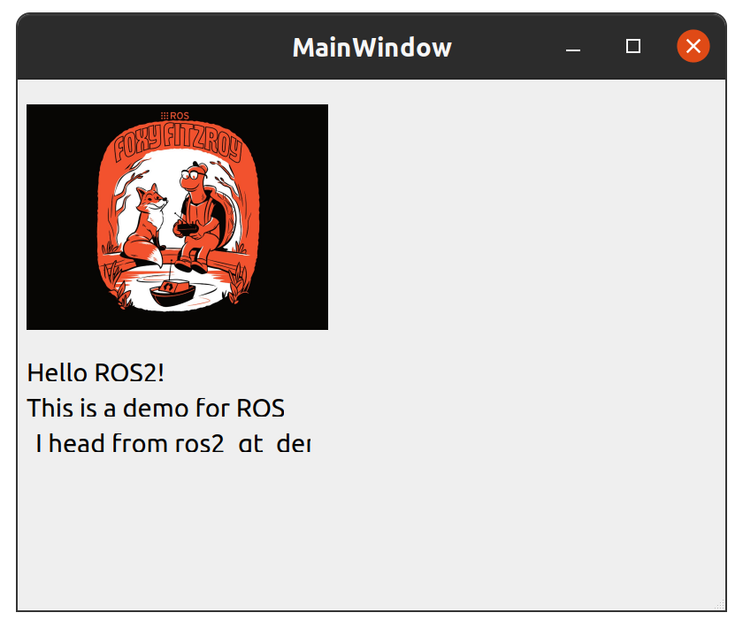
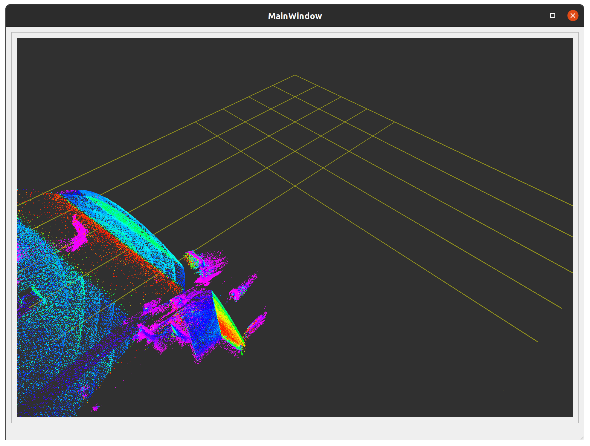

- 如果是使用 `ros2_qt_template` 这个功能包模板进行二次开发，可以克隆 v1 分支：
    ```shell
    git clone --branch v1 https://github.com/SEUZTh/ros2_qt_template.git
    ```
- 如果是学习该教程代码，可以克隆 `master` 分支：
    ```shell
    git clone https://github.com/SEUZTh/ros2_qt_template.git
    ```

- 使用 QT 编译，然后执行功能包：
  - ros2_qt_templete:
    ```shell
    source install/setup.sh
    ros2 run ros2_qt_template ros2_qt_template
    ```
    
  - `ros2_qt_rviz2`:
    ```shell
    source install/setup.sh
    ros2 run ros2_qt_rviz2 ros2_qt_rviz2
    ```
    